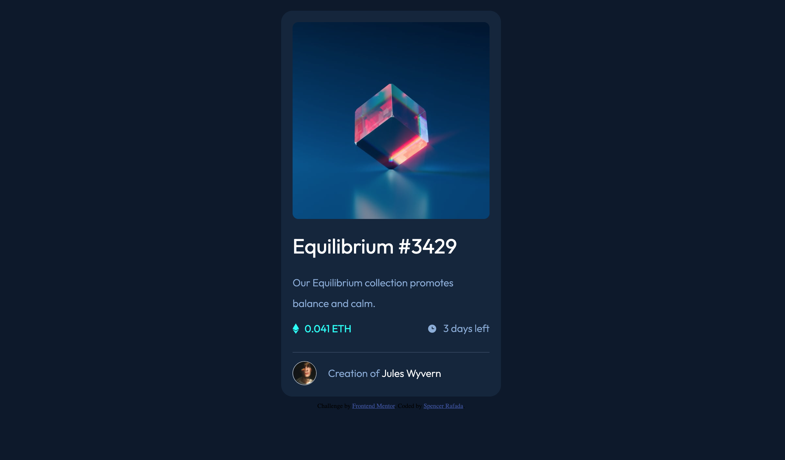
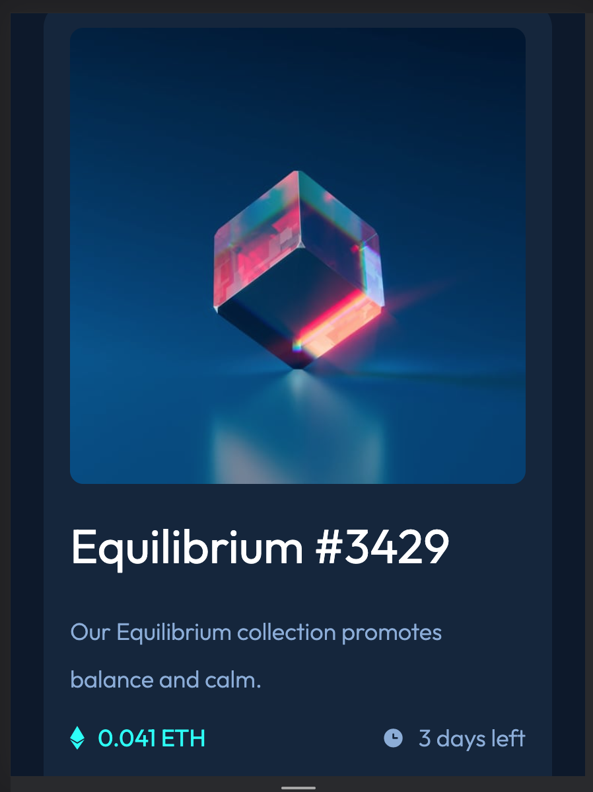

# Frontend Mentor - NFT preview card component solution

This is a solution to the [NFT preview card component challenge on Frontend Mentor](https://www.frontendmentor.io/challenges/nft-preview-card-component-SbdUL_w0U). Frontend Mentor challenges help you improve your coding skills by building realistic projects. 

## Table of contents

- [Overview](#overview)
  - [The challenge](#the-challenge)
  - [Screenshot](#screenshot)
  - [Links](#links)
- [My process](#my-process)
  - [Built with](#built-with)
  - [What I learned](#what-i-learned)
  - [Continued development](#continued-development)
  - [Useful resources](#useful-resources)
- [Author](#author)
- [Acknowledgments](#acknowledgments)

## Overview

### The challenge

Users should be able to:

- View the optimal layout depending on their device's screen size
- See hover states for interactive elements

### Screenshot

### Links

- Solution URL: [GitHub Repository](https://github.com/spencer-rafada/nft-preview-card-component)
- Live Site URL: [GitHub Pages](https://spencer-rafada.github.io/nft-preview-card-component/)

## My process

### Built with

- SCSS
- CSS
- Mobile-First
- BEM Notation

### What I learned

I learned how to start front end development with the Mobile-First Workflow. However, I still don't feel as comfortable as I would want to be. 

### Continued development

I am focusing on learning Mobile-First Development and being able to translate design into code more comfortably.

### Useful resources

- [Example resource 1](https://www.example.com) - This helped me for XYZ reason. I really liked this pattern and will use it going forward.

## Author

- Website - [Spencer Rafada](https://github.com/spencer-rafada)
- Frontend Mentor - [@spencer-rafada](https://www.frontendmentor.io/profile/spencer-rafada)
- LinkedIn - [N. Spencer Rafada](https://www.linkedin.com/in/spencer-rafada/)

## Acknowledgments

To my brother who is the better basketball player. Continue growing. 
